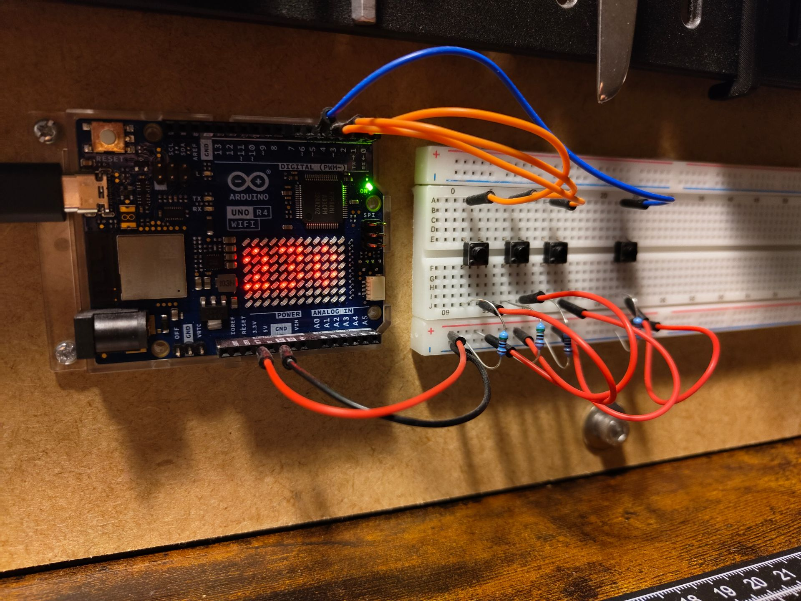

# Arduino workbench controller



Arduino Uno R4 dashboard for interacting with the Philips Hue / Zigbee IoT server[^server] via direct USB serial connection. Built with [PlatformIO](https://platformio.org/).

## Features & Controls

The controller connects to the Rock 3C board via USB-C cable. It communicates over Serial (115200 baud) without requiring any WiFi or Internet connection.

- **left (Pin 2)**: Dim light (`BRIGHTNESS_DOWN`).
- **center (Pin 3)**: Toggle power (`POWER`).
- **right (Pin 4)**: Brighten light (`BRIGHTNESS_UP`).
- **most right (Pin 5)**: Query and sync status (`STATUS`).

## Serial Protocol & Signals

The board communicates over USB Serial at **115200 baud**:

| Event / Button | Signal Sent | LED Matrix Display |
|---|---|---|
| Pin 3 (Power) | `POWER` | Power icon |
| Pin 4 (Plus) | `BRIGHTNESS_UP` | `+` icon |
| Pin 2 (Minus) | `BRIGHTNESS_DOWN` | `-` icon |
| Pin 5 (Update) | `STATUS` | `SYNC` |

### Using PlatformIO Monitor

You can monitor the outgoing signals or send commands directly using the PlatformIO serial monitor:

```bash
make monitor
# or
pio device monitor -p /dev/ttyACM0 -b 115200
```

Supported commands you can type into the monitor:
- `POWER` or `p`: Triggers power toggle signal
- `BRIGHTNESS_UP` or `+`: Triggers brightness increase signal
- `BRIGHTNESS_DOWN` or `-`: Triggers brightness decrease signal
- `STATUS` or `?`: Requests status sync

When connected to the Rock 3C IoT server, the server responds with status updates (e.g. `STATUS state=ON brightness=204`), which are parsed by the board and shown on the 12x8 LED matrix display.

[^server]: [IoT Server](https://github.com/iacobucci/iot-server)